---
title: Prüfungsvorbereitung Scientific Visualization
author:
- Yannick Hutter 
lang: gsw 
date: "06.11.2023"
toc-title: Inhaltsverzeichnis
mainfont: IBMPlexSans
sansfont: IBMPlexSans
monofont: IBMPlexMono 
header-left: "\\small \\thetitle"
header-center: "\\small \\leftmark"
header-right: "\\small \\theauthor"
footer-left: "\\leftmark"
footer-center: ""
footer-right: "\\small Seite \\thepage"
...

# Wissenschaftliche Visualisierung
Die wissenschaftliche Visualisierung ist ein **Teilgebiet der Computergrafik**, welche sich der **visuellen Darstellung naturwissenschaftlicher Phänomene** beschäftigt. Dies soll zu einem besseren Verständnis der zugrunde liegenden Daten führen. Oftmals sind **reinen Simulationsdaten** nicht intuitiv, da sie aus Zahlenwerten bestehen. Hier unterstützt die wissenschaftliche Visualisierung, indem die Zahlenwerte mit einer Vielzahl von Tools visuell dargestellt werden.

## Wissenschaftliche Simulation
Das wissenschaftliche Rechnen wird für die **Rekonstruktion und Vorhersage** von Phänomenen und technischen Prozessen eingesetzt. Gerechnet wird hierbei auf **Supercomputern**. Die Simulation stellt zudem die **dritte Säule** der Erkenntniss dar.

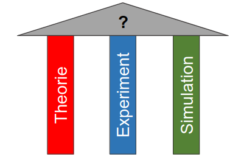{ width=250px }

Doch wofür braucht es überhaupt Simulationen? Hierzu gibt es mehrere Beweggründe:

* Oftmals sind Experimente **unmöglich** (wenn bspw. Unwetter oder Unfällen)
* Häufig sind Experimente **unerwünscht** (bspw. bei Überschwemmungen oder Kernwaffentests)
* Zudem können Experimente sehr **kostenspielig** sein (bspw. Raumfahrt, Medizin etc.)

## Komplexität
Da es sehr **ressourcenintensiv** ist Simulationen durchzuführen, sollte die **richtige Skala** gewählt werden. Bei Berechnungen im **1D-Raum** stehen keine Informationen in Breite und Höhe zur Verfügung. Dies wird beispielsweise bei Flüssen genutzt, um die Höhe der Wassersäule zu bestimmten. Hierbei verläuft der Strich entlang des Flusses, wobei bei jedem Punkt die Höhe reincodiert wird. Ein weiteres beispiel für 1D Simulationen sind Überschwemmungssimulationen. Ein Beispiel für eine Berechnung im **2D-Raum** sind das Vorhersagen von Tsunamis. Hierbei steht ein Gitter zur Verfügung, wobei bei jedem Punkt die Höhe der Wassersäule gespeichert wird. Die zweite Dimension wird hierbei benötigt, da sich der Tsunami in der Breite nicht gleich ausbreitet, bzw. lokal begrenzt ist. Anwendungsfälle im **3D-Raum** sind das Berechnen von Bakterienausbreitungen in einem Raum (bspw. Klassenzimmer etc.). Auch werden das Strömen von Tragflächen oder der Wiedereintritt des Spaceshuttles 3D gerechnet.

> Grundsätzlich sollte die Skala **so klein wie möglich** gewählt werden um den Ressourcen- und Rechenaufwand zu minimieren

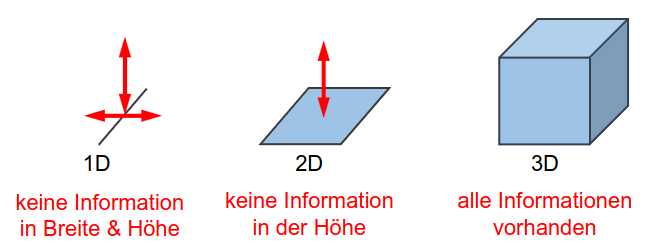{ width=250px }

# Geometrische Modellierung
Die geometrische Modellierung ist ein **Teilaspekt von CAD**. Mit ihr können **Körper als auch deren Materialien** im 3D Raum beschrieben werden.

## Rigid Bodies (starre Körper)
Rigid Bodies sind starre Körper, welche eine **geschlossene Oberfläche** und **keine Löcher** aufweisen. Zudem sind sie **eindeutig orientierbar**, d.h nach innen oder aussen.
Jedoch besteht ein Problem mit Rigid Bodies, die **Mannigfaltikgeit**.

> Mannigfaltigkeit tritt dann auf, wenn eine Kante zu zwei Flächen gehört.

## Indirekte Darstellung
Die indirekte Darstellung **wird in der Computergrafik** verwendet. Die Modell werden hierbei mithilfe von **Drei- oder Vierecken** dargestellt. Die Modelle an sich lassen sich hierbei durch **Knoten(V)**, **Kanten(E)** sowie **Flächen(F)** beschreiben. Die Koten tragen hierbei **die geometrische Information**, die anderen Dinge die **topologische Information**. Eine Vertex besteht aus 3 Koordinaten (x,y,z). Eine Kante besteht aus 2 Vertices und eine Fläche besteht aus 3 Kanten.

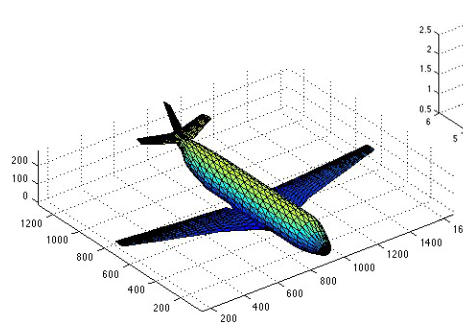{ width=250px }

Mithilfe der **Eulerschen Formel** kann validiert werden, ob ein starrer Körper korrekt modelliert worden ist:

\begin{equation}\label{eq:euler}
    n_{V} - n_{E} + n_{F} = 2 
\end{equation}

### VEF Graph
Der VEF Graph kann genutz werden um ein **3D Modell zu speichern**. Der Vorteil eines VEF Graphen besteht darin, dass bei Translationen, Verschiebungen und Skalierungen lediglich eine Änderung in der Tabelle V (geometrische Information) vorgenommen werden muss.

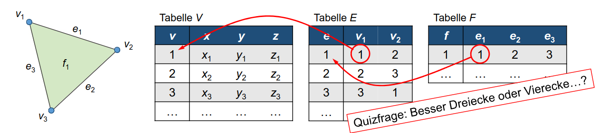{ width=450px }

### Unterschied zwischen konvex und konkav
Bei **konvexen Körpern** kann man irgendwo zwei Punkte wählen und eine Linie ziehen. Die Linie **verlässt dabei nie den Körper**. Dies war ein wichtiges Prinzip bei Computerspielen, da sich **konvexe Körper nicht selbst verdecken können** (Performancesteigerung).

## Direkte Darstellung
Anders als bei der indirekten Darstellung wird bei der direkten Darstellung mit dem **Volumen anstelle der Oberfläche** gearbeitet. Die direkte Darstellung nutzt hierzu verschiedene Primitive wie **Würfel** und **Tetraeder**. Eine Problematik der direkten Darstellung ist, dass **gekrümmte Flächen** nur **approximiert** werden können (aufgrund der gekrümmten Oberfläche und der zugrunde liegenden Primitive).

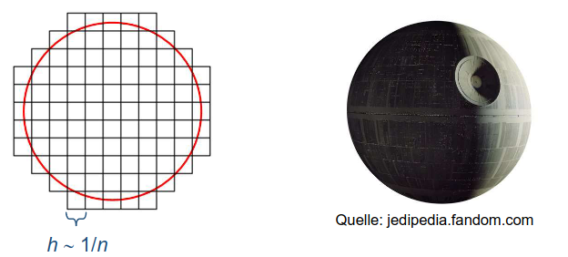{ width=250px }

### Spacetrees
Um Volumenmodelle zu speichern, können Spacetrees verwendet werden. Spacetrees sind eine **Art Baumstruktur**. Für **numerische Stabilität** ist es zudem wichtig, dass die Spacetrees noch **balanciert** werden, dies geschieht typischerweise im Verhältnis 1:2. Das bedeutet, dass bei einem balancierten Spacetree, das Verhältnis der Nachbarvoxeln 1:2 entspricht.

Um Spacetrees zu speichern müssen diese entsprechend **linearisiert und codiert** werden:

* Codierung mit Zahlen: 1 bedeutet dass es ein Elternknoten mit Kind ist, 0 dass es ein Kindknoten ist
* Codierung mit Farben: Rot bedeutet, Blat/Rand innen und Blau bedeutet Blatt aussen

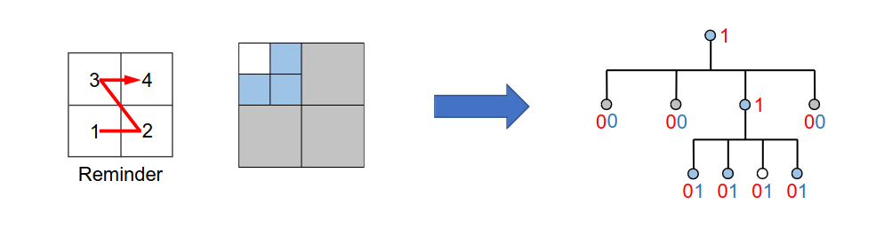

Bei der Linearisierung ist zudem noch die Art und Weise, wie linearisiert wird massgebend. Hierzu gibt es zwei verschiedene Verfahren. Beim **Breadth-First** Verfahren werden die Knoten von **Links nach Rechts** durchlaufen, wohingegen sie beim **Depth-First** Verfahren von **Oben nach Unten** durchlaufen werden.

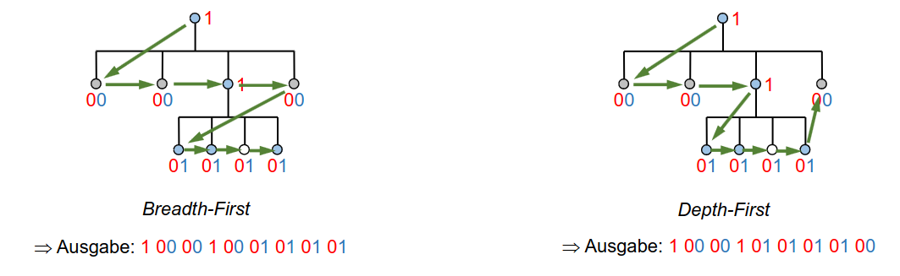

# Lineare Algebra

## Flächennormale (Normalvektor)
Der Normalvektor steht **immer senkrecht auf einer Fläche** und zeigt in der Regel nach Aussen. Der Normalvektor kann über das **Kreuzprodukt** berechnet werden:

\begin{equation}\label{eq:cross_product}
    \vec{a}\times\vec{b} = \begin{pmatrix} a_{1} \\ a_{2} \\ a_{3} \end{pmatrix} \times \begin{pmatrix} b_{1} \\ b_{2} \\ b_{3} \end{pmatrix} = \begin{pmatrix} a_{2}b_{3} - a_{3}b_{2} \\ a_{3}b_{1} - a_{1}b_{3} \\ a_{1}b_{2} - a_{2}b_{1} \end{pmatrix}
\end{equation}

## Skalarprodukt
Das Skalarprodukt kann genutzt werden, um zu überprüfen, **ob zwei Vektoren senkrecht aufeinander stehen**. Zwei Vektoren stehen senkrecht aufeinander, wenn das **Skalarprodukt 0 ist**.

\begin{equation}\label{eq:scalar_product}
    \vec{a} = \begin{pmatrix} 1 \\ 0\\ 0 \end{pmatrix}, \vec{b} = \begin{pmatrix} 0 \\ 0\\ 1 \end{pmatrix} \rightarrow  \vec{a}^T \cdot \vec{b} = \begin{pmatrix} 1 & 0 & 0 \end{pmatrix} \cdot \begin{pmatrix} 0 \\ 0\\ 1 \end{pmatrix} = 1 \cdot 0 + 0 \cdot 0 + 0 \cdot 1 = 0
\end{equation}

Die beiden Vektoren lassen sich über die Knoten berechnen, wobei gilt **Ende - Anfang**. Die Richtung des Normalvektors hängt vom **Umlaufsinn der Ecken** ab. Werden die Eckpunkte im **Gegenuhrzeigersinn** durchlaufen, so gilt die **Rechte-Hand-Regel** und der Normalvektor **zeigt nach Aussen**.

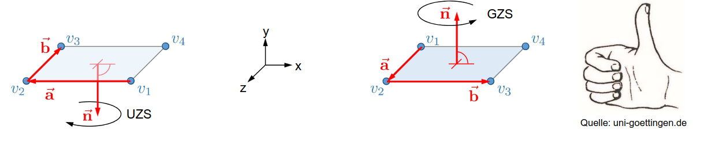

## Enfernung von Rückseiten
Um die Rückseiten eines 3D Modells zu enfernen, welche nicht gesehen werden, wird ein **Betrachterstandpunkt** und eine **Blickrichtung** benötigt. Anschliessend kann über die Bildung des Skalarproduktes mit dem Normalvektor der jeweiligen Flächen ermittelt werden, ob diese Enfernt werden können. Hierbei gibt es drei Fälle:

* Skalarprodukt entspricht dem Wert 0 (Fläche ist degeneriert zur Kante): Fläche muss gezeichnet werden
* Skalarprodukt ist kleiner dem Wert 0 (Fläche entspricht der Vorderseite): Fläche muss gezeichnet werden
* Skalarpdodukt ist grösser dem Wert 0: Fläche **kann entfernt werden**

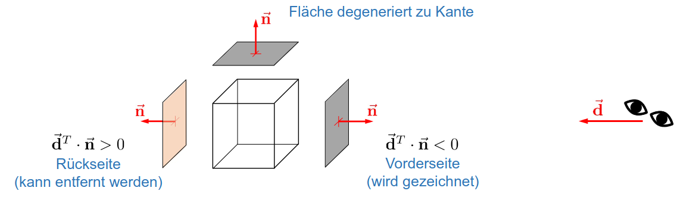

## Schattierung
Schattierung erlaubt es einer Fläche **verschiedene Helligkeits- und Farbwerte abhängig von einer virtuellen Lichtquelle** zuzuweisen.

### Konstante Schattierung
Bei der konstanten Schattierung wird das Beleuchtungsmodell nur **an einem Punkt der Fläche** ausgewertet. Dadurch ist sie **schnell und einfach zu berechnen**, jedoch gibt es **Intensitätssprünge an den Kanten**. Zudem wirken gekrümmte Oberflächen nicht glatt.

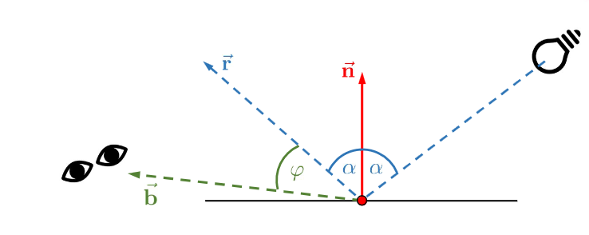

### Interpolierte Schattierung (Gouraud-Schattierung)
Die Gouraud-Schattierung ist eine **interpolierte Schattierung**. Bei dieser Schattierung **gibt es keine Intensitätssprünge an den Kanten**. Zudem wirken auch **gekrümmte Oberflächen glatt**. Der Nachteil dieser Schattierung ist, dass sie aufwändiger zu berechnen ist.

* Berechnen von Ecknormalen
* Berechnung der Intesität in den Ecken via Ecknormalen
* Intensitätsbestimmung entlang der Kanten durch Interpolation der Eckintensitäten

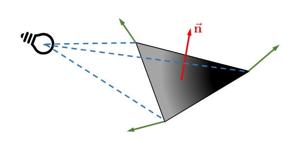{ width=350px }

# Skalare Grössen
Skalare Grössen sind Dinge, bei denen die **messbare Grösse** nur vom **Betrag abhängig ist**. Beispiele hierfür sind:

* Druck
* Temperatur
* Dichte

## Schnittebenen (Darstellung von skalaren Grössen)
Um physikalische Grössen darzustellen werden Schnittebenen verwendet. Sie werden primär für die **Darstellung von 2D Daten** verwendet. Ein Problem mit den Schnittebenen ist jedoch, dass diese beliebig im 3D Raum orientiert werden kann. Daher ist es notwendig, die **Daten auf die Schnittebene zu projektieren**. Dies geschieht mittels **Interpolation**. Zudem sollten die Werte **noch zwischen 0 und 1 normiert werden**.

Um Schnittebenen zu visualisieren gibt es folgende Möglichkeiten:

* Glyphen
* Heatmaps
* Isolinien

## Glyphen
Glyphen **kodieren Werte durch Symbole**. Der eigentliche **Betrag** wird hierbei **durch die Grösse und Farbe** dargestellt. Der Vorteil dieser Methode ist, dass **mehrere multivariate Daten gleichzeitig** dargestellt werden können. Der Nachteil ist jedoch dass es oftmals **unintuitiv ist, es fehlt der physikalische Zusammenhang**.
Glyphen werden beispielsweise genutzt um **Kreissegmente** darzustellen.

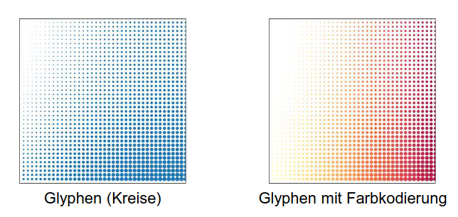{ width=350px }

## Heatmaps
Bei der Heatmap werden **Werte als Pixel codiert**. Der **Betrag des Wertes** wird **als Farbe** dargestellt. Heatmaps verschaffen so einen **schnellen und intuitiven Überblick**. Ausserdem fassen sie **markante Werte gut zusammen**. Jedoch haben Menschen mit **Farbblindheit** Probleme, Heatmaps zu interpretieren. Ein Anwendungsfall für Heatmaps ist beispielsweise die **Visualisierung eines fallenden Tropfens**.

Mit Heatmaps lassen sich die **Werte auch auf 3D Geometrien** proezieren. Dies kann beispielsweise nützlich sein, wenn die Stärke der Verformung bei einer Crash-Simulation gemessen werden soll.

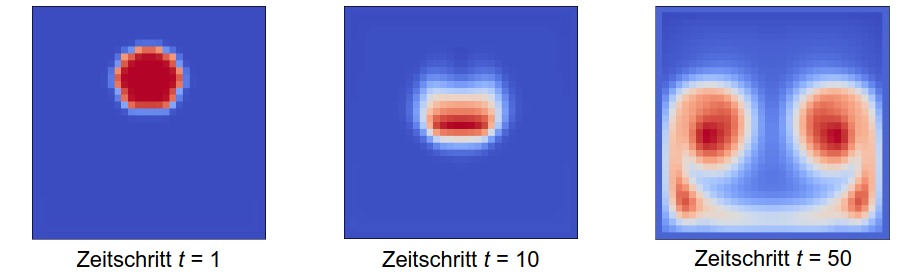{ width=350px }

## Isolinien
Isolinien sind **kurven, welche benachbarte Punkte mit gleichen Werten verbinden**. Der **Betrag** wird hierbei durch **Farbe bzw. Muster** dargestellt. Isolinien bieten somit einen **schnellen, intuitiven Überblick** und **fassen Bereiche gut zusammen**. Jedoch **können Details verloren gehen**. Zudem ist die **Berechnung** aufwändig. Ein Anwendungsbeispiel für Isolinien sind topografische Karten. Das Gegenstück zu den Isolinien im 3D-Raum sind die **Isoflächen**.

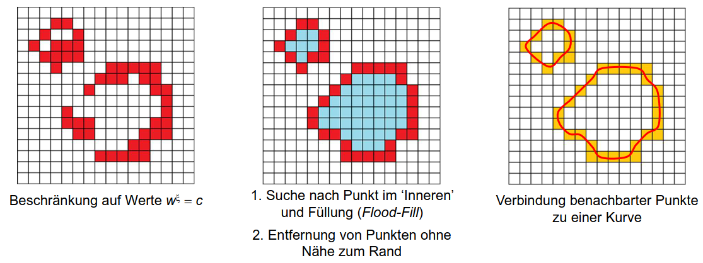{ width=350px }

# Vektorielle Grössen
Vektorielle Grössen haben sowohl **einen Wert als auch eine Richtung**:

* Geschwindigkeit

## Glyphen
Vektorielle Grössen können ebenfalls mit Glyphen visualisiert werden. Die **Richtung wird durch Symbole (Pfeile)** dargestellt. Der **Betrag kann mittels Grösse / Farbe** dargestellt werden.Dies erlaubt einen **schnellen, intuitiven Überblick über Geschwindigkeitsfelder**. Jedoch besteht auch die **Gefahr** des **Informationoverloads**. Ein Anwendungsfall von Glyphen für vektorielle Grössen sind **Nischenströmungen**.

## Heatmaps
Heatmaps eignen sich für vektorielle Grössen nur bedingt. Der **Betrag** kann über die **Farbe** dargestellt werden, jedoch geht **die Richtung verloren**. Ein Beispiel für Heatmaps bei vektoriellen Grössen sind **Nischen- und Mehrphasenströmungen**.

## Stromlinien
Stromlinien sind Kurven, deren **örtliche Tangente in Richtung des Geschwindigkeitsvektors zeigen**. Die Grundidee hinter Stromlinien ist ein **virtuelles Partikel im Fluid**. Kann sowohl im 2D als auch 3D angewandt werden. Der Vorteil von Stromlinien besteht darin, dass **problematische Bereiche gut zu erkennen sind**. Der Nachteil ist jedoch eine **eine Unsicherheit bei der Erfassung aller Details, sowie eine aufwändige Berechnung**.

* Stromlinien können als Höhenlinie einer Strömung verstanden werden
* Bei **konstanter Strömung** können sich **Stromlinien nicht schneiden und sind knickfrei**
* **Kontraktion** bedeutet **Geschwindigkeitszunahme**
* **Gerade Stromlinien** bedeuten **keine Veränderung**

## Bahnlinien
Eine Partikelverfolgung über **mehrere Zeitschritte hinweg** ist mit **Stromlinien nicht zufriedenstellend**. Hier schaffen kommen die Bahnlinien zum Zug. Die Idee hinter Bahnlinien ist die **Partikelverfolgung über mehrere Zeitschritte hinweg**. Ein Anwendungsfall von Bahnlinien ist das Durchströmen eines Aneurysmas.

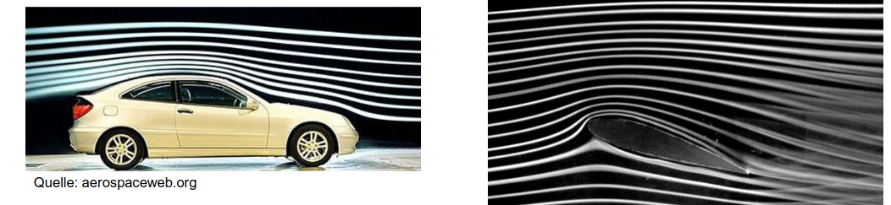{ width=350px }

## Line Integral Convolution (LIC)
Ist eine Methode zur **Visualiserung von stationären 2D-Vektorfelder durch Darstellung von Feldlinien**. Die Idee hierbei ist, dass die **Werte entlang einer Feldlinie stark korrelieren** (im Gegensatz zu den Feldlinien unter sich). LIC erlauben so einen **anschaulichen, intuitiven Überblick und fassen markante Bereiche gut zusammen**. Der Nachteil ist jedoch, dass **keine Richtungsinforation vorhanden ist** und die **Berechnung sehr aufwändig ist**.

Ein Anwendungsfall von LIC sind die Darstellung von **Magnetfeldern durch Eisenfeilspähne**.

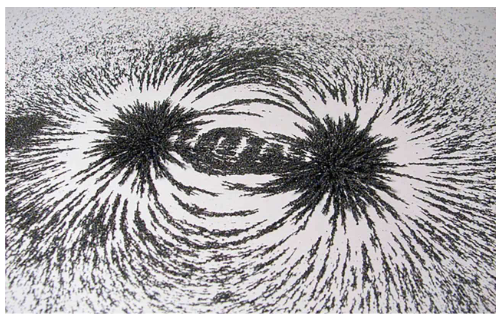{ width=350px }

